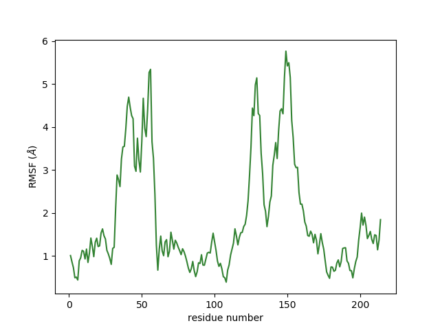

# simulations
Analysis of MD simulations

See contributions to the `aa_analysis` module within the
[multiscale framework](https://github.com/mummi-framework/mummi-ras) (with LLNL)
for more extensive and real-time analysis.

Example protein RMSF calculation:

